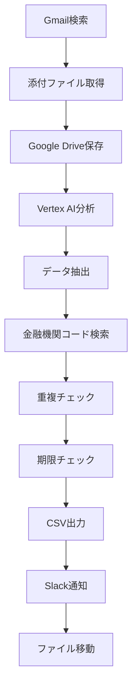

# 請求書自動処理システム

Google Apps Scriptを使用した請求書の自動処理システムです。Gmailから請求書を取得し、Vertex AIで分析、Slackに通知、CSVファイルに出力する一連の処理を自動化します。

## 🚀 機能

- **Gmail自動取得**: 指定した条件のメールから請求書を自動取得
- **AI分析**: Vertex AI (Gemini) を使用した請求書データ抽出
- **金融機関コード検索**: zengin-codeデータベースを使用した銀行・支店コード検索
- **Slack通知**: 処理結果やエラーの自動通知
- **CSV出力**: 振込用CSVファイルの自動生成
- **重複チェック**: 月末振込用CSV内の重複会社検出
- **期限チェック**: 振込期限の緊急度チェック

## 📋 必要な準備

### 1. Google Cloud Platform設定
- GCPプロジェクトの作成
- Vertex AI APIの有効化
- サービスアカウントの作成と認証

### 2. Google Apps Script設定
- 新しいプロジェクトの作成
- 必要なライブラリの追加
- スクリプトプロパティの設定

### 3. Slack設定
- Slackアプリの作成
- Bot Tokenの取得
- チャンネルIDの取得

### 4. Google Drive設定
- 必要なフォルダの作成
- フォルダIDの取得

## ⚙️ セットアップ

### 1. ファイルの配置
```
プロジェクト/
├── analysis.js              # メイン処理スクリプト
├── gmail_to_drive.js        # Gmail処理スクリプト
├── slack_notifications.js   # Slack通知機能
├── appsscript.json          # 設定ファイル
├── config.example.js        # 設定例ファイル
└── README.md               # このファイル
```

### 2. スクリプトプロパティの設定
Google Apps Scriptのスクリプトエディタで以下のプロパティを設定：

| プロパティ名 | 説明 | 例 |
|-------------|------|-----|
| `GCP_PROJECT_NUMBER` | GCPプロジェクト番号 | `your_project_number_here` |
| `UNPROCESSED_FOLDER_ID` | 未処理フォルダID | `your_unprocessed_folder_id_here` |
| `PROCESSED_FOLDER_ID` | 処理不可フォルダID | `your_processed_folder_id_here` |
| `CSV_FOLDER_ID` | CSVフォルダID | `your_csv_folder_id_here` |
| `SLACK_BOT_TOKEN` | Slack Bot Token | `your_slack_bot_token_here` |
| `SLACK_CHANNEL_ID` | SlackチャンネルID | `your_slack_channel_id_here` |
| `GMAIL_SEARCH_QUERY` | Gmail検索クエリ | `subject:(請求書添付) has:attachment -label:(処理済)` |
| `GMAIL_LABEL_NAME` | Gmailラベル名 | `処理済` |

### 3. 権限の設定
`appsscript.json`で必要なOAuthスコープが設定されていることを確認：

```json
{
  "oauthScopes": [
    "https://www.googleapis.com/auth/script.external_request",
    "https://www.googleapis.com/auth/cloud-platform",
    "https://www.googleapis.com/auth/drive",
    "https://www.googleapis.com/auth/gmail.modify",
    "https://www.googleapis.com/auth/script.send_mail",
    "https://www.googleapis.com/auth/spreadsheets"
  ]
}
```

## 🔧 使用方法

### 1. Gmail処理の実行
```javascript
saveAttachmentsToDrive()
```

### 2. 請求書処理の実行
```javascript
main()
```

### 3. トリガー設定
- **Gmail処理**: 1時間ごとに実行
- **請求書処理**: Gmail処理後に実行、または30分ごとに実行

## 📊 処理フロー



## 🛠️ 主要機能

### 1. 請求書データ抽出
- 発行会社名
- 振込先銀行・支店
- 預金種目
- 口座番号
- 受取人名（半角カタカナ）
- 振込金額
- 振込期限

### 2. 金融機関コード検索
- zengin-codeデータベースを使用
- 銀行名・支店名の正規化
- 完全一致・部分一致検索
- フォールバック機能

### 3. 重複・期限チェック
- 月末振込用CSV内の重複会社検出
- 振込期限の緊急度チェック
- インタラクティブなSlack通知

### 4. CSV出力
- UTF-8 BOM付きCSV
- ヘッダーなし形式
- 自動ファイル作成・更新

## 🔒 セキュリティ

- 機密情報はスクリプトプロパティで管理
- 設定例ファイル（`config.example.js`）を提供
- `.gitignore`で機密ファイルを除外

## 📝 注意事項

1. **API使用料**: Vertex AIの使用量に応じて料金が発生します
2. **実行時間制限**: Google Apps Scriptの実行時間制限（6分）に注意
3. **ファイル形式**: PDF、テキストファイルに対応
4. **文字エンコーディング**: CSVファイルはUTF-8 BOM付きで出力

## 🐛 トラブルシューティング

### よくある問題

1. **Vertex AI認証エラー**
   - GCPプロジェクトの設定を確認
   - サービスアカウントの権限を確認

2. **Slack通知エラー**
   - Bot Tokenの有効性を確認
   - チャンネルIDの正確性を確認

3. **ファイル読み取りエラー**
   - ファイル形式の対応状況を確認
   - ファイルサイズ制限を確認

## 📄 ライセンス

このプロジェクトはMITライセンスの下で公開されています。

## 🤝 貢献

プルリクエストやイシューの報告を歓迎します。

## 📞 サポート

問題が発生した場合は、GitHubのIssuesで報告してください。