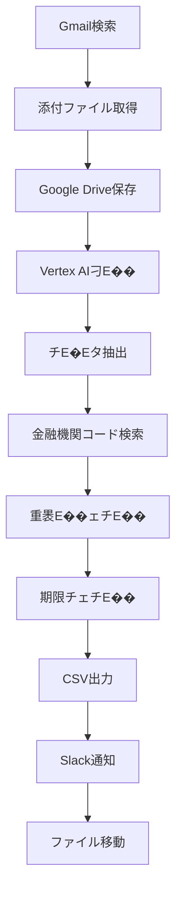

# 請求書自動�E琁E��スチE��

Google Apps Scriptを使用した請求書の自動�E琁E��スチE��です、Emailから請求書を取得し、Vertex AIで刁E��、Slackに通知、CSVファイルに出力する一連の処琁E��自動化します、E

## 🚀 機�E

- **Gmail自動取征E*: 持E��した条件のメールから請求書を�E動取征E
- **AI刁E��**: Vertex AI (Gemini) を使用した請求書チE�Eタ抽出
- **金融機関コード検索**: zengin-codeチE�Eタベ�Eスを使用した銀行�E支店コード検索
- **Slack通知**: 処琁E��果めE��ラーの自動通知
- **CSV出劁E*: 振込用CSVファイルの自動生戁E
- **重褁E��ェチE��**: 月末振込用CSV冁E�E重褁E��社検�E
- **期限チェチE��**: 振込期限の緊急度チェチE��

## 📋 忁E��な準備

### 1. Google Cloud Platform設宁E
- GCPプロジェクト�E作�E
- Vertex AI APIの有効匁E
- サービスアカウント�E作�Eと認証

### 2. Google Apps Script設宁E
- 新しいプロジェクト�E作�E
- 忁E��なライブラリの追加
- スクリプトプロパティの設宁E

### 3. Slack設宁E
- Slackアプリの作�E
- Bot Tokenの取征E
- チャンネルIDの取征E

### 4. Google Drive設宁E
- 忁E��なフォルダの作�E
- フォルダIDの取征E

## ⚙︁EセチE��アチE�E

### 1. ファイルの配置
```
プロジェクチE
├── analysis.js          # メイン処琁E��クリプト
├── gmail_to_drive.js    # Gmail処琁E��クリプト
├── appsscript.json      # 設定ファイル
├── config.example.js    # 設定例ファイル
└── README.md           # こ�Eファイル
```

### 2. スクリプトプロパティの設宁E
Google Apps ScriptのスクリプトエチE��タで以下�Eプロパティを設定！E

| プロパティ吁E| 説昁E| 侁E|
|-------------|------|-----|
| `GCP_PROJECT_NUMBER` | GCPプロジェクト番号 | `your_project_number_here` |
| `UNPROCESSED_FOLDER_ID` | 未処琁E��ォルダID | `your_unprocessed_folder_id_here` |
| `PROCESSED_FOLDER_ID` | 処琁E��可フォルダID | `your_processed_folder_id_here` |
| `CSV_FOLDER_ID` | CSVフォルダID | `your_csv_folder_id_here` |
| `SLACK_BOT_TOKEN` | Slack Bot Token | `xoxb-...` |
| `SLACK_CHANNEL_ID` | SlackチャンネルID | `your_slack_channel_id_here` |
| `GMAIL_SEARCH_QUERY` | Gmail検索クエリ | `subject:(請求書添仁E has:attachment -label:(処琁E��E` |
| `GMAIL_LABEL_NAME` | Gmailラベル吁E| `処琁E��E |

### 3. 権限�E設宁E
`appsscript.json`で忁E��なOAuthスコープが設定されてぁE��ことを確認！E

```json
{
  "oauthScopes": [
    "https://www.googleapis.com/auth/script.external_request",
    "https://www.googleapis.com/auth/cloud-platform",
    "https://www.googleapis.com/auth/drive",
    "https://www.googleapis.com/auth/gmail.modify",
    "https://www.googleapis.com/auth/script.send_mail",
    "https://www.googleapis.com/auth/spreadsheets"
  ]
}
```

## 🔧 使用方況E

### 1. Gmail処琁E�E実衁E
```javascript
saveAttachmentsToDrive()
```

### 2. 請求書処琁E�E実衁E
```javascript
main()
```

### 3. トリガー設宁E
- **Gmail処琁E*: 1時間ごとに実衁E
- **請求書処琁E*: Gmail処琁E��に実行、また�E30刁E��とに実衁E

## 📊 処琁E��ロー



## 🛠�E�E主要機�E

### 1. 請求書チE�Eタ抽出
- 発行会社吁E
- 振込先銀行�E支庁E
- 預��種目
- 口座番号
- 受取人名（半角カタカナ！E
- 振込金顁E
- 振込期限

### 2. 金融機関コード検索
- zengin-codeチE�Eタベ�Eスを使用
- 銀行名・支店名の正規化
- 完�E一致・部刁E��致検索
- フォールバック機�E

### 3. 重褁E�E期限チェチE��
- 月末振込用CSV冁E�E重褁E��社検�E
- 振込期限の緊急度チェチE��
- インタラクチE��ブなSlack通知

### 4. CSV出劁E
- UTF-8 BOM付きCSV
- ヘッダーなし形弁E
- 自動ファイル作�E・更新

## 🔒 セキュリチE��

- 機寁E��報はスクリプトプロパティで管琁E
- 設定例ファイル�E�Econfig.example.js`�E�を提侁E
- `.gitignore`で機寁E��ァイルを除夁E

## 📝 注意事頁E

1. **API使用斁E*: Vertex AIの使用量に応じて料��が発生しまぁE
2. **実行時間制陁E*: Google Apps Scriptの実行時間制限！E刁E��に注愁E
3. **ファイル形弁E*: PDF、テキストファイルに対忁E
4. **斁E��エンコーチE��ング**: CSVファイルはUTF-8 BOM付きで出劁E

## 🐛 トラブルシューチE��ング

### よくある問顁E

1. **Vertex AI認証エラー**
   - GCPプロジェクト�E設定を確誁E
   - サービスアカウント�E権限を確誁E

2. **Slack通知エラー**
   - Bot Tokenの有効性を確誁E
   - チャンネルIDの正確性を確誁E

3. **ファイル読み取りエラー**
   - ファイル形式�E対応状況を確誁E
   - ファイルサイズ制限を確誁E

## 📄 ライセンス

こ�Eプロジェクト�EMITライセンスの下で公開されてぁE��す、E

## 🤁E貢献

プルリクエストやイシューの報告を歓迎します、E

## 📞 サポ�EチE

問題が発生した場合�E、GitHubのIssuesで報告してください、E
