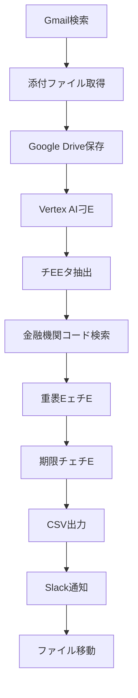

# 請求書自動E琁EスチE

Google Apps Scriptを使用した請求書の自動E琁EスチEです、Emailから請求書を取得し、Vertex AIで刁E、Slackに通知、CSVファイルに出力する一連の処琁E自動化します、E

## 🚀 機E

- **Gmail自動取征E*: 持Eした条件のメールから請求書をE動取征E
- **AI刁E**: Vertex AI (Gemini) を使用した請求書チEEタ抽出
- **金融機関コード検索**: zengin-codeチEEタベEスを使用した銀行E支店コード検索
- **Slack通知**: 処琁E果めEラーの自動通知
- **CSV出劁E*: 振込用CSVファイルの自動生戁E
- **重褁EェチE**: 月末振込用CSV冁EE重褁E社検E
- **期限チェチE**: 振込期限の緊急度チェチE

## 📋 忁Eな準備

### 1. Google Cloud Platform設宁E
- GCPプロジェクトE作E
- Vertex AI APIの有効匁E
- サービスアカウントE作Eと認証

### 2. Google Apps Script設宁E
- 新しいプロジェクトE作E
- 忁Eなライブラリの追加
- スクリプトプロパティの設宁E

### 3. Slack設宁E
- Slackアプリの作E
- Bot Tokenの取征E
- チャンネルIDの取征E

### 4. Google Drive設宁E
- 忁Eなフォルダの作E
- フォルダIDの取征E

## ⚙︁EセチEアチEE

### 1. ファイルの配置
```
プロジェクチE
├── analysis.js          # メイン処琁Eクリプト
├── gmail_to_drive.js    # Gmail処琁Eクリプト
├── appsscript.json      # 設定ファイル
├── config.example.js    # 設定例ファイル
└── README.md           # こEファイル
```

### 2. スクリプトプロパティの設宁E
Google Apps ScriptのスクリプトエチEタで以下Eプロパティを設定！E

| プロパティ吁E| 説昁E| 侁E|
|-------------|------|-----|
| `GCP_PROJECT_NUMBER` | GCPプロジェクト番号 | `your_project_number_here` |
| `UNPROCESSED_FOLDER_ID` | 未処琁EォルダID | `your_unprocessed_folder_id_here` |
| `PROCESSED_FOLDER_ID` | 処琁E可フォルダID | `your_processed_folder_id_here` |
| `CSV_FOLDER_ID` | CSVフォルダID | `your_csv_folder_id_here` |
| `SLACK_BOT_TOKEN` | Slack Bot Token | `xoxb-...` |
| `SLACK_CHANNEL_ID` | SlackチャンネルID | `your_slack_channel_id_here` |
| `GMAIL_SEARCH_QUERY` | Gmail検索クエリ | `subject:(請求書添仁E has:attachment -label:(処琁EE` |
| `GMAIL_LABEL_NAME` | Gmailラベル吁E| `処琁EE |

### 3. 権限E設宁E
`appsscript.json`で忁EなOAuthスコープが設定されてぁEことを確認！E

```json
{
  "oauthScopes": [
    "https://www.googleapis.com/auth/script.external_request",
    "https://www.googleapis.com/auth/cloud-platform",
    "https://www.googleapis.com/auth/drive",
    "https://www.googleapis.com/auth/gmail.modify",
    "https://www.googleapis.com/auth/script.send_mail",
    "https://www.googleapis.com/auth/spreadsheets"
  ]
}
```

## 🔧 使用方況E

### 1. Gmail処琁EE実衁E
```javascript
saveAttachmentsToDrive()
```

### 2. 請求書処琁EE実衁E
```javascript
main()
```

### 3. トリガー設宁E
- **Gmail処琁E*: 1時間ごとに実衁E
- **請求書処琁E*: Gmail処琁Eに実行、またE30刁Eとに実衁E

## 📊 処琁Eロー



## 🛠EE主要機E

### 1. 請求書チEEタ抽出
- 発行会社吁E
- 振込先銀行E支庁E
- 預種目
- 口座番号
- 受取人名（半角カタカナ！E
- 振込金顁E
- 振込期限

### 2. 金融機関コード検索
- zengin-codeチEEタベEスを使用
- 銀行名・支店名の正規化
- 完E一致・部刁E致検索
- フォールバック機E

### 3. 重褁EE期限チェチE
- 月末振込用CSV冁EE重褁E社検E
- 振込期限の緊急度チェチE
- インタラクチEブなSlack通知

### 4. CSV出劁E
- UTF-8 BOM付きCSV
- ヘッダーなし形弁E
- 自動ファイル作E・更新

## 🔒 セキュリチE

- 機寁E報はスクリプトプロパティで管琁E
- 設定例ファイルEEconfig.example.js`Eを提侁E
- `.gitignore`で機寁Eァイルを除夁E

## 📝 注意事頁E

1. **API使用斁E*: Vertex AIの使用量に応じて料が発生しまぁE
2. **実行時間制陁E*: Google Apps Scriptの実行時間制限！E刁Eに注愁E
3. **ファイル形弁E*: PDF、テキストファイルに対忁E
4. **斁EエンコーチEング**: CSVファイルはUTF-8 BOM付きで出劁E

## 🐛 トラブルシューチEング

### よくある問顁E

1. **Vertex AI認証エラー**
   - GCPプロジェクトE設定を確誁E
   - サービスアカウントE権限を確誁E

2. **Slack通知エラー**
   - Bot Tokenの有効性を確誁E
   - チャンネルIDの正確性を確誁E

3. **ファイル読み取りエラー**
   - ファイル形式E対応状況を確誁E
   - ファイルサイズ制限を確誁E

## 📄 ライセンス

こEプロジェクトEMITライセンスの下で公開されてぁEす、E

## 🤁E貢献

プルリクエストやイシューの報告を歓迎します、E

## 📞 サポEチE

問題が発生した場合E、GitHubのIssuesで報告してください、E
